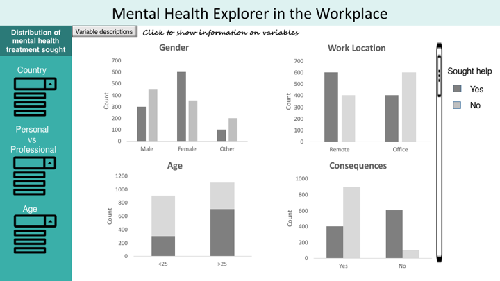

# Mental Health In The Work Place App : Proposal

## Section 1 - Overview

The productivity loss and absences from work due to mental health might negatively impact a business and cost employers a significant amount of money. We would like to build a data visualization application that will allow employers to explore factors that may lead to employees seeking help for a mental health condition. The application will show the distributions of treatment sought (Yes/No) per gender, age, family history, work location (remote or office), mental health benefits provided at work, observed consequences, and available resources. Users will also be able to filter the data based on specified countries so that data can be viewed for different geographical locations and cultures. Ultimately, we hope that our application will help employers design company policies and develop effective mental wellness programs, therefore creating a safe and productive working environment where employees will not be afraid to discuss their mental health issues and seek treatment.

## Section 2 - Description of the Data

We will be visualizing a survey dataset consisting of about 1200 entries that measure the attitude of employees towards mental health issues. Each of our entries will have 10 variables associated to whether an employee has sought treatment for their mental health issues. Our visualizations will consider the following variables from the survey:  employees’ age (Age) and gender (Gender), the country they are working in (Country), whether they have a family history of mental issues (family_history), details about how their work may affect their decision to seek help (work_interfere, remote_work, benefits, seek_help, obs_consequence), and finally, whether or not they have sought treatment (treatment). With this information, we will also filter the visualized data further by categorizing them by country, personal (i.e. age, gender) vs work environment (i.e. benefits, seek-help).

## Section 3 - Usage scenario & tasks

The human resources team of tech company, ABC, has been tasked with organizing a seminar on mental health treatment to encourage employees to seek help when needed. They’ve learnt from experience that focus group discussions are one of the most productive and effective because they allow to share messages targeted at specific groups. In order to do so, the HR team would like to explore a dataset in order to identify factors that may lead to employees seeking help for a mental health condition. When they log on to the “Mental Health Treatment” app, they will first choose the country they are based in. This is important and very useful for multinational companies because mental health issues may be perceived differently across  cultures. They will then be able to access the distributions of treatment sought (Yes/No), per gender, age, family history, work location (remote or office), benefits provided, observed consequences, and available resources. When they do so, they might notice the following 3 trends:

1. Men seem to be less likely to seek treatment for mental health issues than women
2. Employees working remotely are more likely to treat their mental health condition than office-based employees
3. Younger employees appear to be less likely to seek help than older employees

From their observations, they conclude that the focus groups split will be based on age, gender and work location. In addition, they will adjust the content of their presentation accordingly, to make it as relevant as possible for each group.

## Section 4 - Description of Application

The application will have a landing page with an interactive world map which will be color coded based on the distribution of the response rates of the survey. When the users will click on a country, they will be taken to a page with more detailed graphical analysis for the selected country. This page will have bar charts, distribution graphs, and anything relevant. For example, they will be able to see the distribution of age groups that have and haven't sought mental health treatment. On the side, there will be two dropdown menus, one which filters the data by age and another which indicates whether the data is personal or professional. The raw data can also be filtered by different age groups or gender if needed. Personal data consists of data such as age or gender, and professional data consists of data that pertain to employees' working environment. The application will allow users to easily filter data and perform exploratory analysis on issues of mental health treatment. At most four graphs will be displayed at a time, with a scroll bar to scroll down and see more charts and graphs.

## App Sketch

## Landing page

## Second page

