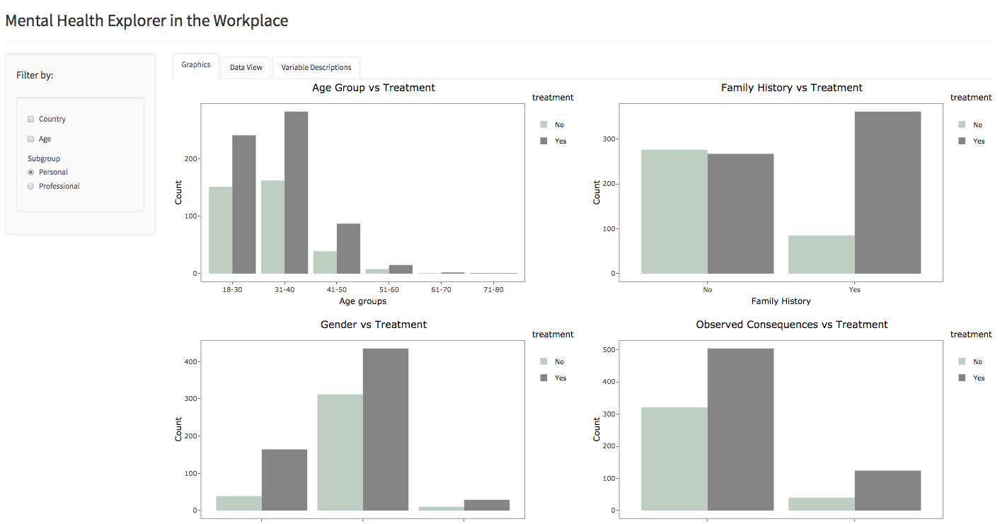
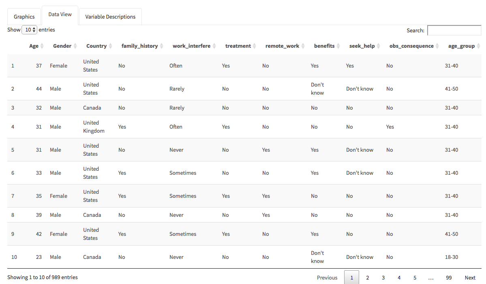
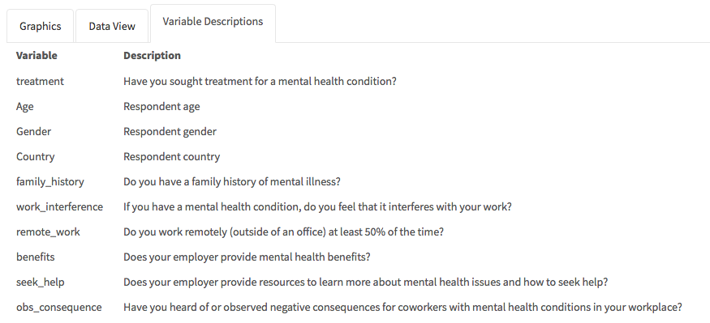
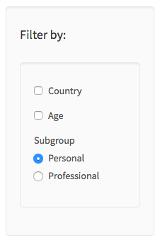
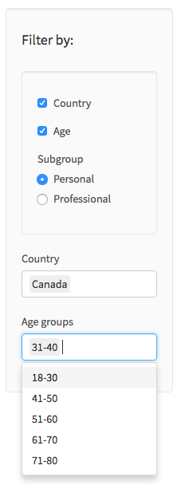
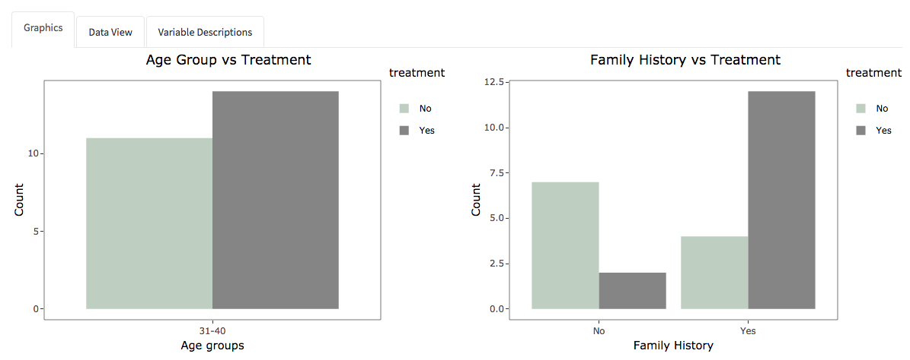
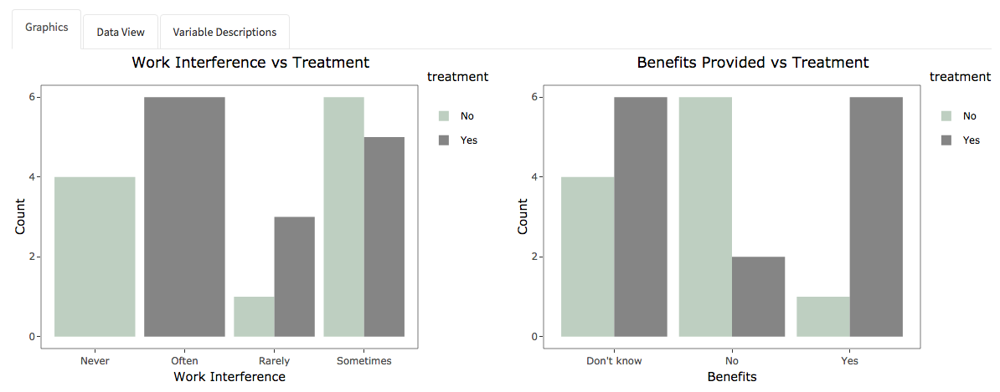

# Milestone 2 Writeup


### Presentation of the Application

<a href="https://ptung.shinyapps.io/ellognea-ptung-mental-health/">The Mental Health Explorer in the Workplace</a>  application explores factors that may lead to employees seeking help for a mental health condition with the <a href="https://www.kaggle.com/osmi/mental-health-in-tech-survey"> Mental Health in Tech Survey </a> dataset. It has three main components:

1. Tabs (Graphics, Data View and Data description)
2. Filters (Country, Age, Professional/Personal)
3. Interactive plots

This is the landing page of our app:



We will now go into further details.

### Functionalities and  Design choices rationale

#### Tabs
We have three tabs in our app: Graphics, Data, and Variable Descriptions.

The ```Graphics``` tab can be seen from the landing page, so a screenshot is not provided. On this tab, users are able to interact with 8 dynamic plots created from the filtered data. The filters and the graphs will be discussed later.

The ```Data View``` tab shows the data in a table format. The table content changes with the filter selections and the variables can be sorted alphabetically and numerically. We chose to make the data dynamic so that users can esily access the relevant information that went into making the plots they choose to display.



Lastly, the ```Variable Descriptions``` tab shows what each variable means. We've explicitly defined the variables in order to avoid any confusion that might hinder the interpretability of the plots.



#### Filters

Our App has three main filters: Country, Age, Personal/Professional. They allow the users to  go deeper in their understanding of the data by exploring it in different ways.  

- Personal/Professsional : The app has 8 graphs that can be grouped into two categories; personal and professional. The personal plots show the relationship between mental health treatment sought and socio-demographic variables such as Age. The professional plots pertain to workplace related variables such as benefits provided.  This filter not only enables the users to focus on related plots but also allows to display all graphs without scrolling.

- Country and Age:  When unchecked, this filter allows to explore the data for all countries and age groups. The users can also narrow their analysis focus by selecting their countries and age groups. We added this functionality because mental health issues may be perceived differently across cultures and age groups.
 



#### Graphics



 It carries more information using the hovering facility. It allows the reader to go deeper in its

understanding of the data, since he can play with it and try to answer its own question

encoded in color, size and grouping


### Data Extraction


### Prior Visions and Future Goals

From the eyes of us creators, the application is fairly straight forward to use. 
As the creators of the application, we both found that we have create a very pleasant application that is easy to use and solves the problem we set out to solve. Overall, our final draft was created with the sketches we drew in milestone 1 in mind. However, with that being said, we definitely have made some changes. We made two very big changes. The first one is that we decided to not implement a map for our visualization application. While we were developing the app, we found that a map that simply showed response rates adds very little value and meaning. Furthermore, to create an effective map would take a lot of time, which we unfortunately do not have this week. The second change we made was that we implemented the use of tabs. Tabs allow users to effectively switch between different views such as graphics or data tables. 

In the future, we hope that we could implement better aesthetics as well as better functionalities to our graphics. For now, the filters seem fairly simple and although they work well, there definitely could be some aesthetic changes.
