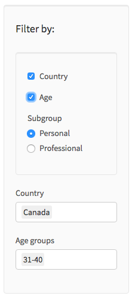

# Milestone 2 Writeup


### Presentation of the Application

<a href="https://ptung.shinyapps.io/ellognea-ptung-mental-health/">The Mental Health Explorer in the Workplace</a>  application explores factors that may lead to employees seeking help for a mental health condition with the <a href="https://www.kaggle.com/osmi/mental-health-in-tech-survey"> Mental Health in Tech Survey </a> dataset. It has three main components:

1. Tabs (Graphics, Data View and Data description)
2. Filters (Country, Age, Professional/Personal)
3. Interactive plots

This is the landing page of our app:


We will now go into further details.

### Functionalities and  Design choices rationale

#### Tabs
We have three tabs in our app: Graphics, Data, and Variable Descriptions.

The ```Graphics``` tab can be seen from the landing page, so a screenshot is not provided. On this tab, users are able to interact with 8 dynamic plots created from the filtered data. The details of our filters and the graphs will be discussed later.

The ```Data View``` tab shows the data in a table format. The table content changes with the filter selections and the variables can be sorted alphabetically and numerically. We chose to make the view of our data dynamic so that users can easily access the relevant information that went into creating the plots they choose to display.


Lastly, the ```Variable Descriptions``` tab shows the meaning of each variable. We have explicitly defined the variables in order to avoid any confusion that might hinder the interpretability of the plots.


#### Filters

Our app has three main filters: Country, Age, Personal/Professional. These filters allow users to dive deeper into their understanding of the data by exploring it in different ways.  

- Personal/Professsional : The app has 8 graphs that can be grouped into two categories; personal and professional. The personal plots are related to socio-demographic variables such as Age. The professional plots pertain to workplace related variables such as benefits provided.  This filter not only enables the users to focus on related plots but also allows to display all graphs without scrolling.

- Country and Age:  When unchecked, these filters allow users to explore the data for all countries and age groups. The users can also narrow their analysis focus by selecting their countries and age groups. We added this functionality because mental health issues may be perceived differently across cultures and age groups.


Furthermore, in regards to our Age and Country filters, users are able to select multiple values. For example, a user can choose to view graphs concerning "Canada, USA, and France". 




#### Interactive plots

We opted for grouped barcharts because they are easy to interpret and can enable users to compare information about different sub-groups of the same category (our variables are categorical). We encoded our charts in color, size and grouping.

- Color : The categories of the treatment variable (No/Yes) are encoded in dark grey (Yes) and light grey (No)

- Size: The height of the bars represent the number of responses

- Grouping: Every category of the variables on the X-axis (age, gender, benefits) has a cluster of columns

Our interactive plots allow the users to answer their own questions by playing with them. Additiontally, the hovering effect enables the app to display more information such as the number of responses.


### Prior Visions and Future Goals

We believe our application is pleasant, fairly easy to use and solves the problem set out to solve. Our app was development with a mindset that visualizations should be simple and meaningful. We did not want to implement too many features because there is a risk of overshadowing important information. 

Overall, our final draft was created with the sketches we drew in milestone 1 in mind. However, we made two big changes. The first one is that we decided to not implement a map for our visualization application. While we were developing the app, we found that a map that simply showed response rates adds very little value and meaning. Furthermore, to create an effective map would take a lot of time, which we unfortunately do not have this week. The second change we made was that we implemented the use of tabs. Tabs allow users to effectively switch between different views such as graphics or data tables.

In the future, we hope that we could implement better aesthetics as well as better functionalities to our graphics. We are looking forward to next week's feedback session.
