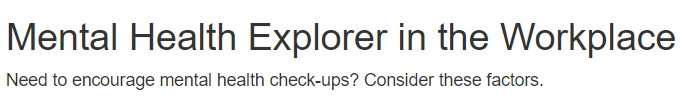
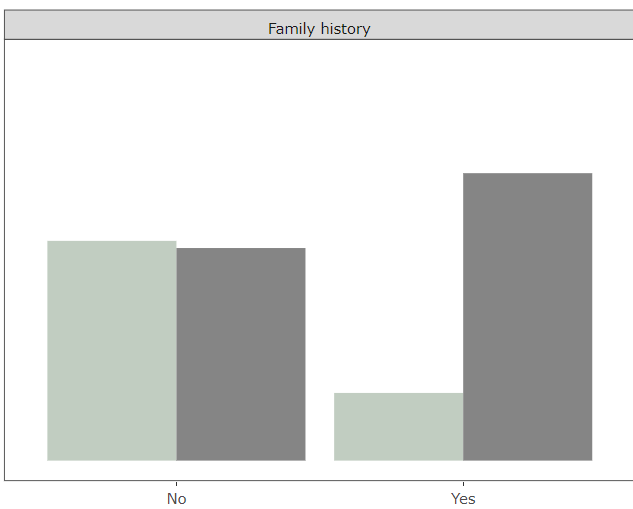
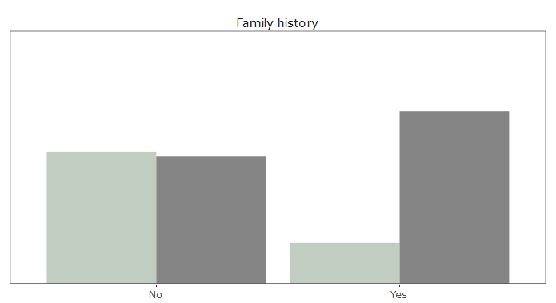
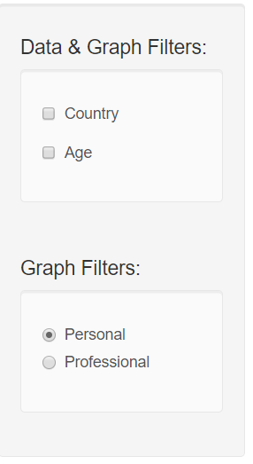
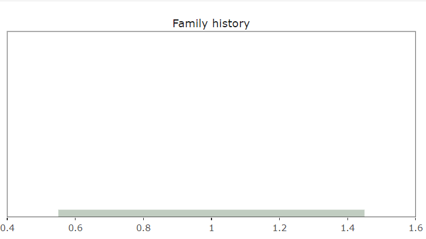
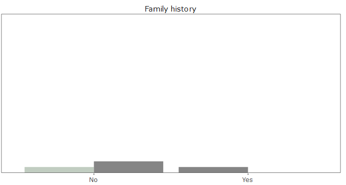

# Milestone 4 Writeup

Authors: Patrick Tung, Orphelia Ellogne

## What changes did we make?

For milestone 4, we have made the following implementations:

First, we specified the objective of the app by adding a use case below the title: "Need to encourage mental health check-ups? Consider these factors". Our goal in doing so was to manage users' expectations before they start exploring the app. Therefore, prompting our users to easily see how to use our visualization app.

Second, we improved the overall aesthetics of our graphs:
- We made them smaller so they can all fit into a full screen (1920 x 1080) window without scrolling.
- We enhanced the readability of the plots titles by removing the borders and the colored background. 
- We removed unnecessary gaps between the X-axis and the graphs as we do not have any negative values. 

**Before**

**After**

Furthermore, we clarified the functionalities of the filters by making the label of our filters more descriptive. Previously, it was not clear that the `Type` filter only applies to the graphs while the `Country` and `Age` filters apply to both the data and the graphs. We changed the labels to `Graph` filters and ` Data & Graphs` filters, respectively. 

**Before**

**After**

Lastly, we worked on two bugs. We've realized that we have the following error when no data is selected: "An error has occurred. Check your logs or contact the app author for clarification". We were unable to provide a solution to the error given the time constraint, but to compensate, we changed the error message to "Please select a country or age group". However, upon starting the app, when transitioning between tabs, the error still exists.

In addition, when the last two age groups (61-70 and 71-80) were selected, the x-scale of all graphs were losing their labels to a continuous scale (0.4 to 1.6 for example). We understand that this was because these age groups have few observations (3 and 1, respectively). We fixed the bug by combining them into a single age group 61-80.

**Before**

**After**

## What would we do differently?

If we were to make the app again, we would change the creation process. First, when we were assigned this project, we put a heavy emphasis on fancy designs instead of focusing on meaningful features that are aligned with our app's objective. Since this was our first visualization app, we wanted to develop an application that was fancy and “cool-looking”. For example, we envisioned maps and other features that were “cool” to have. However, as the project progressed, we realized that many of these features were simply for show and provided little to no meaning to the application. This ended up wasting some of our time that could have been spent on other essential functions. The second thing that we would change builds off this idea. We would get feedback from our peers and/or TAs on our app sketch before implementing our ideas. Talking through our plan with a third party would help us identify the disconnect between the end goal and the product features. This was one of the main insights of the feedback session cycles (fly-on-the-wall and informed-run).

## What challenges did we face?

We did not encounter any major challenges when developing the app but the small obstacles we faced were time consuming and required extensive research. We noticed that to some extent, `ggplotly` and `ggplot` did not work well with each other. For example, when we converted our graphs from `ggplot` to `ggplotly`, the space between the legend label (Treatment) and the legend indicators (Yes/No) significantly increased. After doing some research and reading the documentations, we realized that `ggplotly` had some issues when dealing with legend positions from `ggplot`. We took a couple of hours to resolve this issue using a workaround. 
Overall, we faced typical new Shiny developers' challenges, such as implementing the proper filters, or picking the right width and height for our plots. We are confident that the process will be much smoother when we build our second app.

